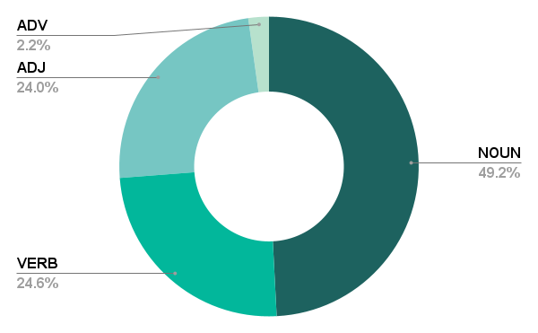

## Ro-AWL - "Automatic Extraction of the Romanian Academic Word List: Data and Methods"
### Ana-Maria Bucur, Andreea Dincă, Madalina Chitez and Roxana Rogobete

### Abstract
*This paper presents the methodology and data used for the automatic extraction of the Romanian Academic Word List (Ro-AWL). Academic Word Lists are useful in both L2 and L1 teaching contexts. For the Romanian language, no such resource exists so far. Ro-AWL has been generated by combining methods from corpus and computational linguistics with L2 academic writing approaches. We use two types of data: (a) existing data, such as the Romanian Frequency List based on the ROMBAC corpus, and (b) self-compiled data, such as the expert academic writing corpus EXPRES. For constructing the academic word list, we follow the methodology for building the Academic Vocabulary List for the English language. The distribution of Ro-AWL features (general distribution, POS distribution) into four disciplinary datasets is in line with previous research. Ro-AWL is freely available and can be used for teaching, research and NLP applications.*

### Ro-AWL



It contains 332 nouns, 166 verbs, 162 adjectives, 15 adverbs and 2 conjunctions. The complete list of Romanian Academic Word list can be found in `Ro-AWL.csv`.

### Citation
If you find our work useful, please cite us:

```
@inproceedings{bucur2023automatic,
  author="Bucur, Ana-Maria and Dincă, Andreea and Chitez, Madalina and Rogobete, Roxana",
  title="Automatic Extraction of the Romanian Academic Word List: Data and Methods",
  booktitle="Proceedings of the International Conference on Recent Advances in Natural Language Processing (RANLP 2023)",
  year="2023",
}
```
